# SI Logit 사용자 가이드

SI Logit은 컴퓨터에서 사용한 앱과 창 활동을 기록해 시간 사용을 돌아보고, 필요할 때 로컬 AI로 요약·검색·대화를 할 수 있게 돕는 개인용 활동 로그입니다. 기본 데이터는 내 기기에 저장됩니다.

> **개인정보 안내**  화면 캡처, OCR, 클라우드 AI는 민감한 내용을 다룰 수 있습니다. 처음에는 캡처만 켜고, 스크린샷·OCR·외부 AI는 필요성을 확인한 뒤 켜는 것을 권장합니다.

## 목차

1. [설치와 첫 실행](#설치와-첫-실행)
2. [화면 구성과 기록 상태](#화면-구성과-기록-상태)
3. [시간 기록 보기](#시간-기록-보기)
4. [카테고리와 앱 관리](#카테고리와-앱-관리)
5. [AI 요약과 OCR 검색](#ai-요약과-ocr-검색)
6. [채팅](#채팅)
7. [Work Log와 Jira](#work-log와-jira)
8. [AI 설정](#ai-설정)
9. [설정](#설정)
10. [내보내기·보존·삭제](#내보내기보존삭제)
11. [개인정보와 클라우드](#개인정보와-클라우드)
12. [문제 해결](#문제-해결)

## 설치와 첫 실행

### 오프라인으로 설치하기

1. [v0.8.24 Release](https://github.com/CheoluPark/si_logit_v2/releases/tag/v0.8.24)의 모든 asset을 한 폴더에 내려받습니다.
2. 그 폴더에서 PowerShell을 열고 `powershell -ExecutionPolicy Bypass -File .\INSTALL-OFFLINE.ps1`를 실행합니다. 분할 archive를 합쳐 `offline-assets` 폴더를 만듭니다.
3. 같은 폴더의 `SI.Logit_0.8.24_x64-setup.exe`를 실행하고 화면 안내에 따라 설치합니다.
4. 시작 메뉴에서 **SI Logit**을 실행합니다. 계정 생성이나 로그인 없이 사용할 수 있습니다.
5. 인터넷 연결이 없어도 활동 기록, 통계, 설치된 로컬 AI 기능은 사용할 수 있습니다. 다만 모델·OCR 구성 요소 다운로드, 업데이트 확인, Jira 연결 및 클라우드 AI에는 연결이 필요할 수 있습니다.

Windows에서 알 수 없는 앱 경고가 보이면, 배포처와 파일을 확인한 뒤에만 계속 진행하세요.

### 첫 실행 체크리스트

1. 왼쪽 아래 상태가 **기록 중**인지 확인합니다.
2. **설정 → 일반**에서 기기 이름과 표시 언어를 정합니다.
3. 활동 기록 간격, 유휴 시간, 업무 시간을 필요에 맞게 조정합니다.
4. 스크린샷과 상주 텍스트 인식(OCR)은 필요할 때만 켭니다.
5. AI를 쓰려면 **AI 설정 → 엔진**, **모델**에서 로컬 구성 요소와 모델 상태를 확인합니다.

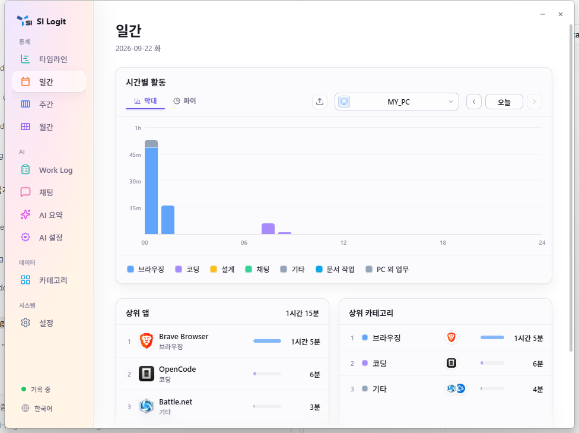

*그림 1. 일간 화면: 시간별 활동, 상위 앱과 카테고리를 한 화면에서 확인합니다.*

## 화면 구성과 기록 상태

왼쪽 메뉴에서 다음 화면으로 이동합니다.

- **타임라인 / 일간 / 주간 / 월간**: 시간 사용 기록과 통계
- **Work Log / 채팅 / AI 요약 / AI 설정**: 기록을 AI와 업무 흐름에 활용
- **카테고리**: 앱 분류와 앱 할당
- **설정**: 수집, 저장소, 개인정보, 화면, 업데이트 관리

왼쪽 아래의 상태는 현재 수집 상태를 나타냅니다.

- **기록 중**: 활동을 수집 중입니다.
- **유휴**: 컴퓨터를 사용하지 않는 시간으로 판단된 상태입니다.
- **휴식 중**: 설정한 업무 시간 밖입니다.
- **오류**: 수집에 문제가 있을 수 있습니다. 설정과 권한을 확인하세요.

상태 영역을 눌러 기록을 멈추거나 다시 시작할 수 있습니다. 기록을 멈춘 동안의 활동은 나중에 복원되지 않습니다.

## 시간 기록 보기

### 타임라인

1. **타임라인**을 엽니다.
2. 이전/다음 화살표 또는 **오늘**으로 날짜를 바꿉니다.
3. 기기 선택 메뉴에서 보고 싶은 기기를 선택합니다.
4. 카테고리별 막대를 보고 어느 시간대에 무엇을 했는지 확인합니다.

자리 비움 시간도 별도 행으로 보일 수 있습니다. 이는 앱 사용 시간이 아닙니다.

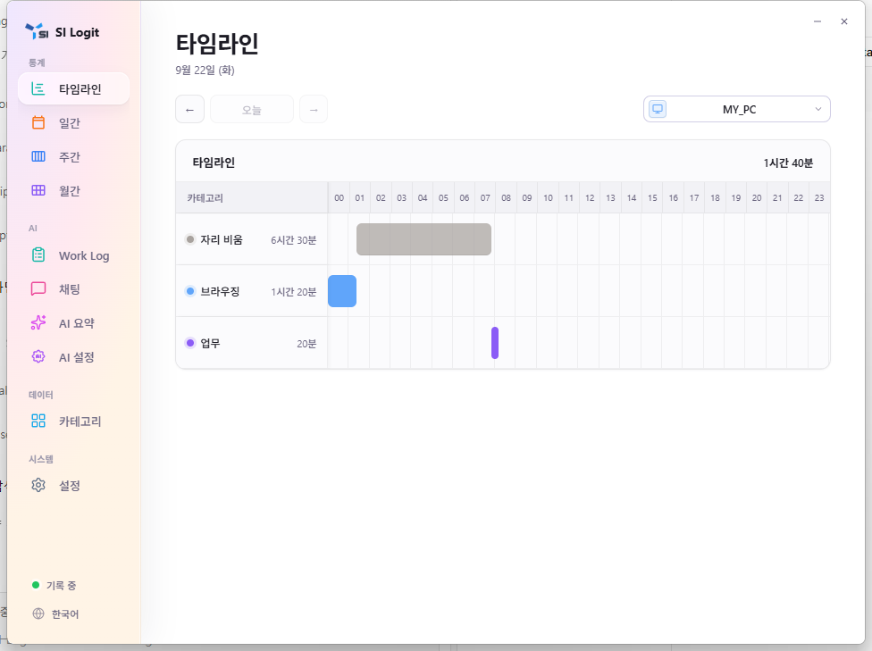

*그림 2. 타임라인: 하루의 활동과 자리 비움 시간을 시간대별로 표시합니다.*

### 일간

**일간**에서는 하루 활동을 막대 그래프 또는 파이 보기로 확인합니다. 날짜와 기기를 바꾸고, 상위 앱·상위 카테고리에서 사용 시간을 비교하세요. 앱을 선택하면 해당 앱 안에서 기록된 창 제목 수준의 활동을 더 살펴볼 수 있습니다.

### 주간

**주간**에서는 한 주의 일별 사용량과 순위를 비교합니다. 이전/다음 주로 이동해 업무 패턴이나 카테고리 변화가 있었는지 확인하세요. 주간 단위 내보내기도 이 화면에서 시작할 수 있습니다.

### 월간

**월간**에서는 날짜별 사용량과 월간 카테고리·앱 순위를 봅니다. 월을 바꿔 장기 추세를 확인하고, 필요하면 월간 범위로 내보내세요.

## 카테고리와 앱 관리

**카테고리**에는 **카테고리 목록**과 **앱 할당** 탭이 있습니다.

1. **카테고리 목록**에서 **새 카테고리** 또는 **대분류 추가**를 선택합니다.
2. 이름·색상·아이콘을 정하고, 카테고리 행의 **앱 추가**로 앱을 넣습니다.
3. **앱 할당** 탭에서는 수집된 앱을 찾아 다른 카테고리로 배정합니다.
4. 편집 또는 삭제 아이콘으로 분류를 정리합니다.

카테고리는 통계와 AI 요약의 기준이 됩니다. 분류를 바꾸면 이후 화면에서 보는 분류 방식도 달라집니다.

> **주의**  앱을 숨김 카테고리에 넣으면 차트와 AI 요약에서 보이지 않지만, 데이터 자체를 지우는 동작은 아닙니다. 앱 데이터 삭제는 되돌릴 수 없으므로 [내보내기·보존·삭제](#내보내기보존삭제)를 먼저 확인하세요.

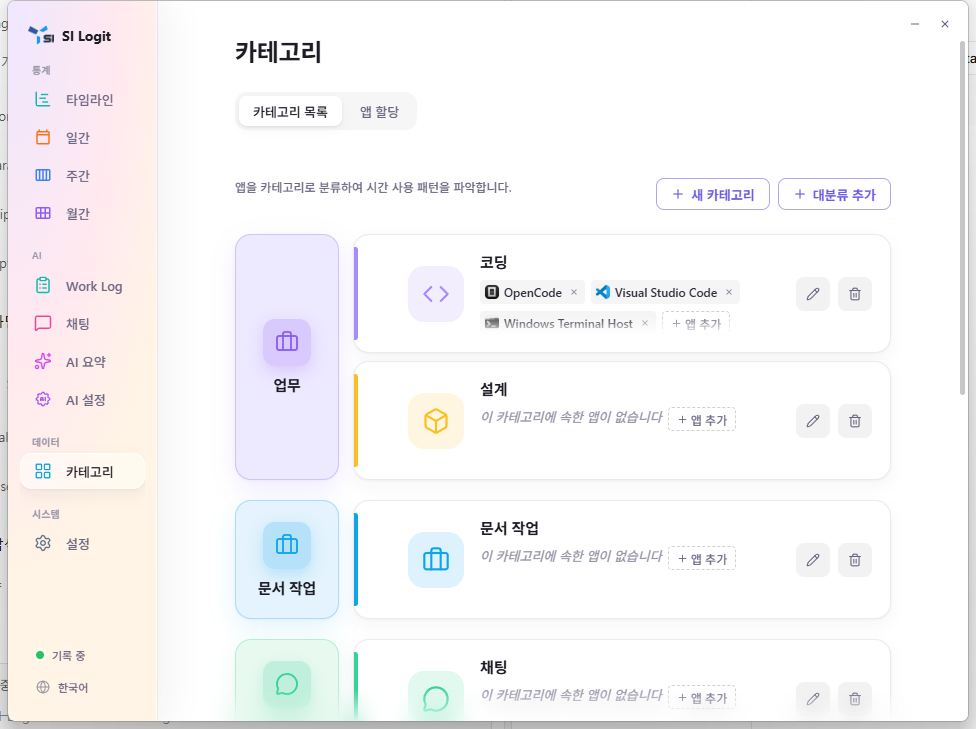

*그림 3. 카테고리 목록: 대분류와 카테고리를 만들고 앱을 연결합니다.*

## AI 요약과 OCR 검색

### AI 요약

1. **AI 요약**을 엽니다.
2. **일간**, **주간**, **월간** 탭에서 기간을 선택합니다.
3. **요약 시작**을 눌러 선택한 기록의 요약을 생성합니다.
4. 생성된 요약은 필요하면 Markdown으로 내보냅니다.

일간 요약은 설정한 시간 구간별로 표시됩니다. 기록이나 AI 엔진·모델이 준비되지 않았다면 해당 구간에 요약이 없을 수 있습니다. 자동 요약은 **AI 설정 → 일반**에서 켤 수 있습니다.

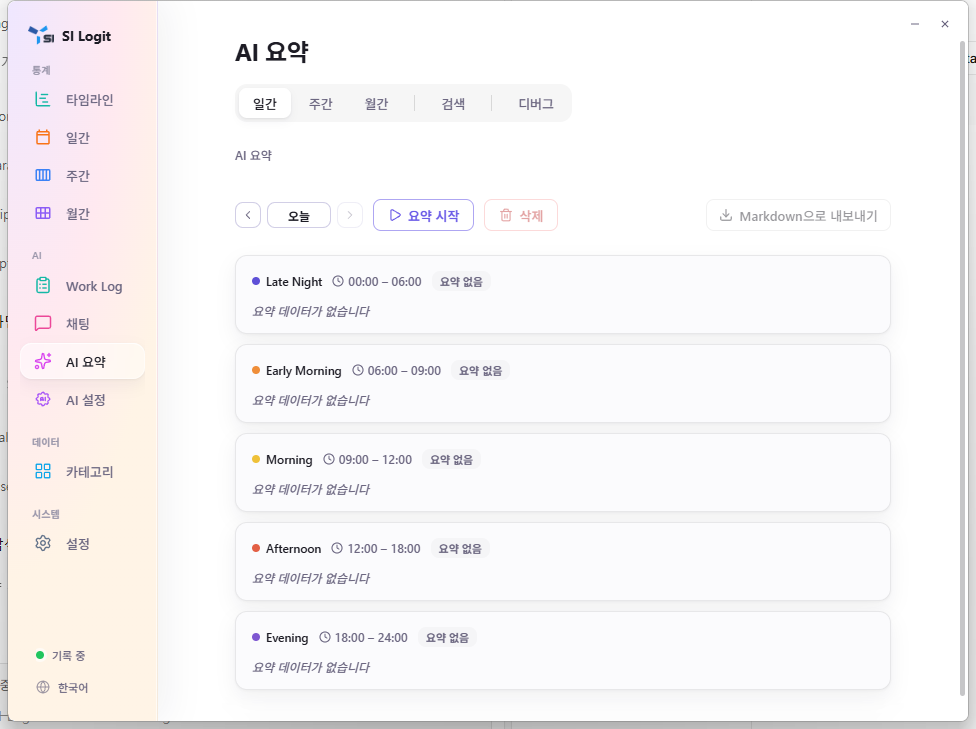

*그림 4. AI 요약: 선택한 날짜의 시간 구간별 요약을 생성하고 내보낼 수 있습니다.*

### OCR 화면 검색

OCR 검색은 저장된 스크린샷에서 인식한 텍스트를 찾는 기능입니다.

1. 먼저 **설정 → 일반**에서 캡처와 스크린샷을 켭니다.
2. 상주 텍스트 인식을 켜거나, 기존 스크린샷에 대해 텍스트 인식을 실행합니다. 필요한 OCR 구성 요소 다운로드를 승인합니다.
3. **AI 요약**의 **검색** 탭에서 화면에 보였던 단어를 입력합니다.
4. 결과를 선택해 시간과 스크린샷을 확인합니다.

스크린샷 보존 기간이 지나 파일이 정리된 결과는 이미지 대신 텍스트만 보일 수 있습니다. OCR은 이미지에 실제로 남아 있는 글자만 찾으며, 모든 화면 내용을 완벽히 인식하지는 않습니다.

## 채팅

**채팅**에서는 “오늘 무엇을 했나요?”, “이번 주 코딩 시간은?”처럼 기록에 대해 질문할 수 있습니다.

1. **채팅**에서 **새 채팅**을 선택합니다.
2. 예시 질문을 고르거나 입력창에 질문을 씁니다.
3. 필요하면 입력창의 모델 선택에서 자동 또는 사용할 모델을 고릅니다.
4. 답변과 대화 목록을 확인합니다.

처음 전송할 때 개인정보 확인 창이 표시됩니다. 로컬 모델은 기기에 설치된 모델로 처리하지만, 클라우드 경로를 선택하면 질문과 검색에 사용된 화면 텍스트 조각이 제3자 서비스로 전송될 수 있습니다. 표시된 제공자와 모델을 확인한 뒤에만 승인하세요.

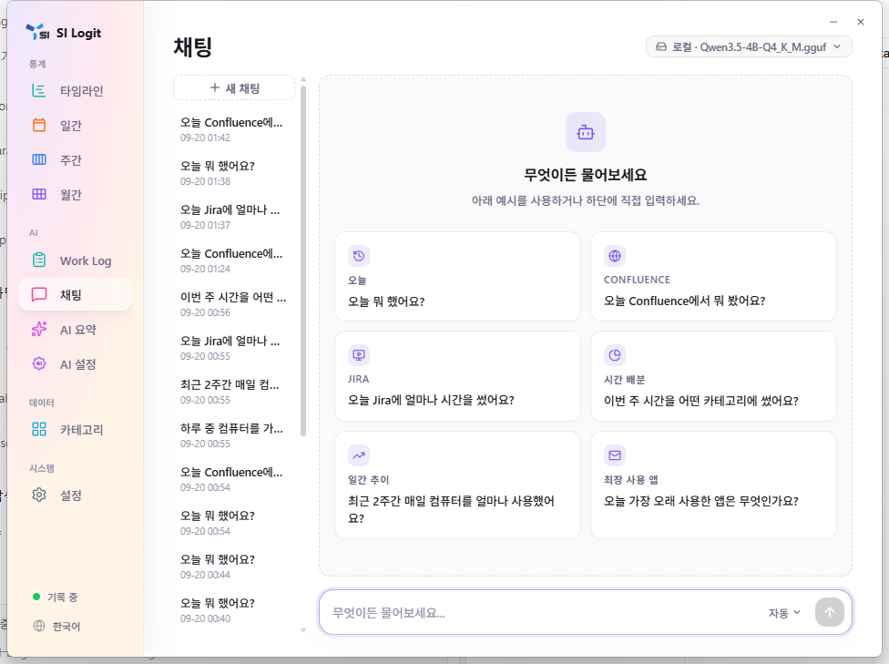

*그림 5. 채팅: 새 대화를 시작하거나 기록 기반의 예시 질문을 선택합니다.*

## Work Log와 Jira

Work Log는 선택한 날짜의 활동을 Jira 작업 항목과 연결해 작업일지 초안을 만드는 화면입니다.

1. **Work Log**를 열고 날짜를 선택합니다.
2. **Work Item 가져오기**를 눌러 Jira 작업 항목을 불러옵니다.
3. 표시된 항목의 활동 연결과 생성된 작업일지 내용을 확인합니다.
4. 필요한 내용을 수정한 뒤 복사해 Jira 등에 붙여 넣습니다.

Jira 연동은 **AI 설정 → Jira**에서 서버 URL과 개인 액세스 토큰(PAT)을 입력해야 합니다. 연결에 실패했을 때 표시되는 테스트 항목은 실제 Jira 작업 항목이 아니므로 제출용으로 사용하지 마세요.

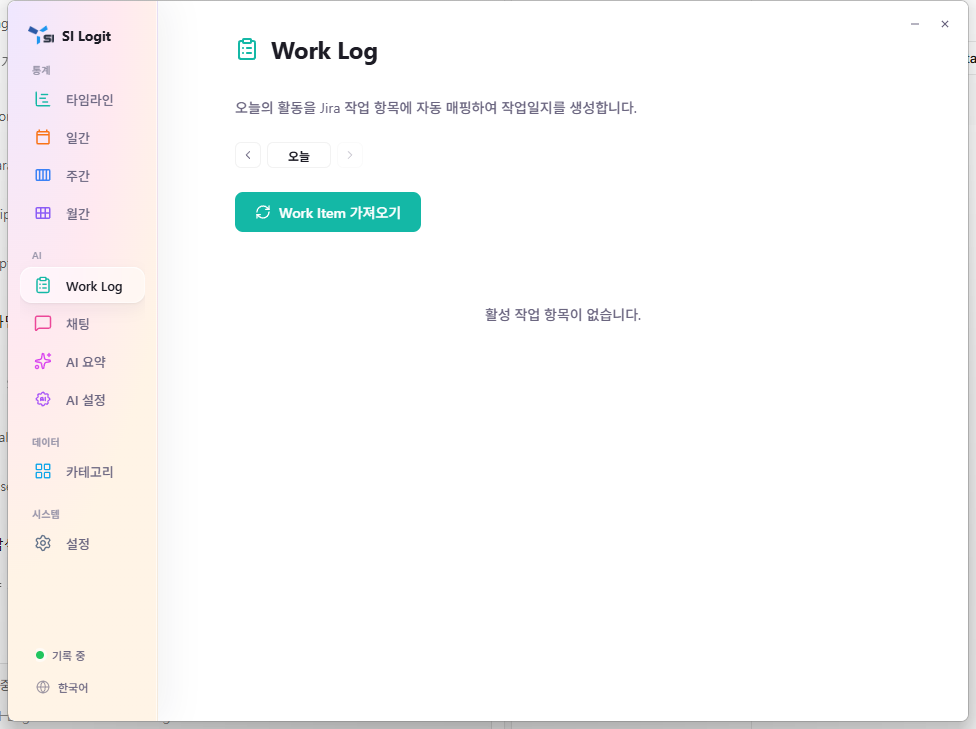

*그림 6. Work Log: 날짜별 활동을 Jira 작업 항목에 연결해 작업일지를 만듭니다.*

## AI 설정

AI 설정은 로컬 AI 실행 환경, 모델, 요약 범위, 지시문, Jira 연결을 관리합니다. 설정을 크게 바꾸기 전에는 현재 동작을 확인하고 한 항목씩 변경하세요.

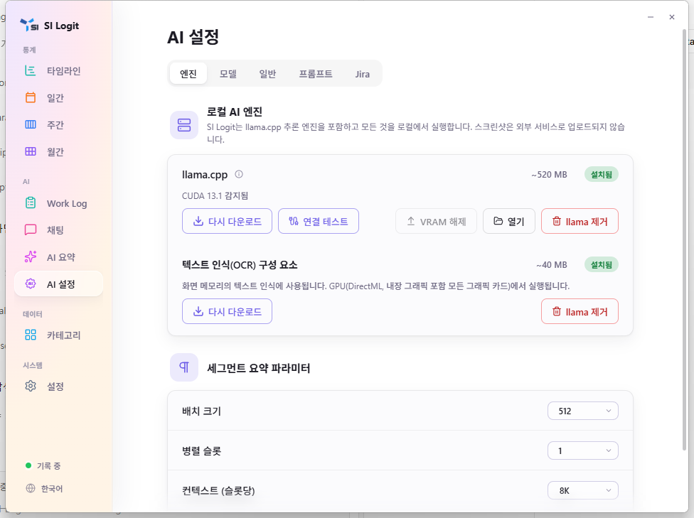

*그림 7. AI 설정 → 엔진: 로컬 엔진과 OCR 구성 요소의 설치 상태를 확인합니다.*

### 엔진

- 로컬 AI 엔진과 텍스트 인식(OCR) 구성 요소의 설치 상태를 확인합니다.
- 필요한 구성 요소는 다운로드하고, **연결 테스트**로 실행 여부를 확인합니다.
- 세그먼트 요약의 배치 크기, 병렬 슬롯, 컨텍스트 크기를 조정할 수 있습니다. 추천 값이 있으면 먼저 추천 값을 사용하세요.
- 엔진이나 OCR 구성 요소를 제거하면 해당 로컬 AI/OCR 기능이 동작하지 않습니다. 다시 사용하려면 다시 내려받아야 합니다.

### 모델

- 로컬 GGUF 모델을 내려받아 관리합니다.
- 설치한 모델을 요약 단계에 할당합니다. 시각 입력이 필요한 단계에는 지원되는 모델만 선택할 수 있습니다.
- 모델 파일 위치는 **설정 → 데이터**에서 바꿀 수 있습니다. 파일을 임의로 이동하거나 지우면 모델을 다시 지정하거나 내려받아야 할 수 있습니다.

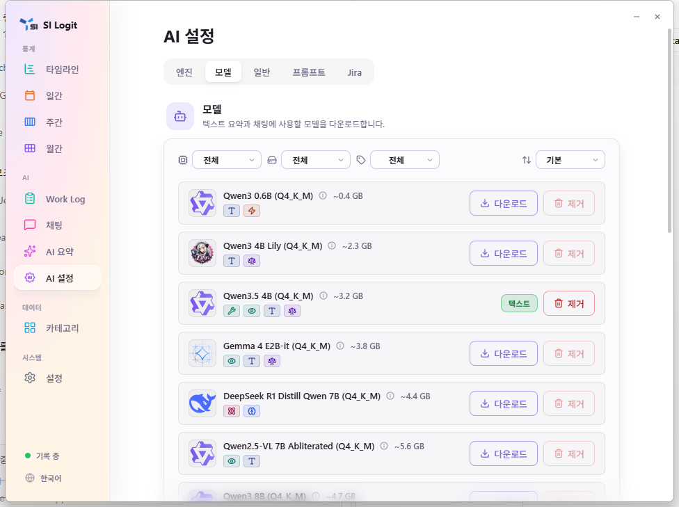

*그림 8. AI 설정 → 모델: 로컬 모델의 용량과 상태를 확인하고 다운로드하거나 제거합니다.*

### 일반

- **자동 요약**을 켜고 실행 시각을 정합니다. 기본 시각을 포함해 여러 시각을 추가할 수 있습니다.
- 일일 OCR 처리를 예약할 수 있습니다. 캡처와 스크린샷이 꺼져 있으면 사용할 수 없습니다.
- AI 요약의 시간 구간을 편집하고, 요약에서 제외할 카테고리를 선택합니다.

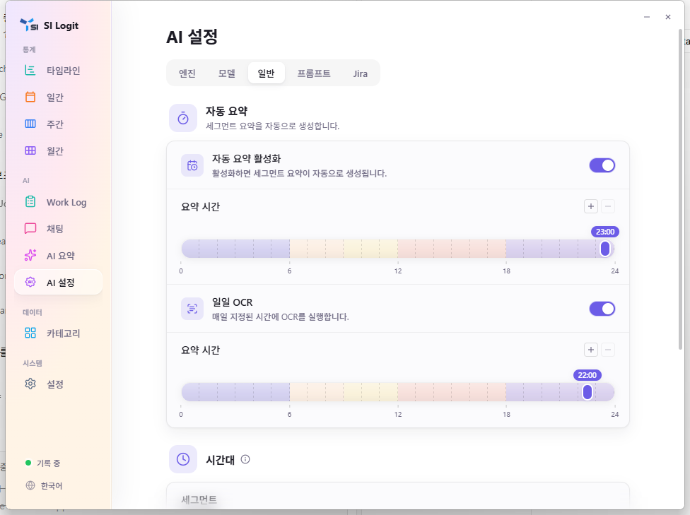

*그림 9. AI 설정 → 일반: 자동 요약과 일일 OCR의 실행 시각을 설정합니다.*

### 프롬프트

- 요약에 쓰는 시스템 프롬프트를 현재 언어별로 검토·편집합니다.
- **저장**을 눌러야 변경이 적용됩니다. **재설정**은 기본 문구를 편집기에 불러오며, 저장 전에는 적용되지 않습니다.
- 사용자 정보란에는 요약의 관점에 도움이 되는 짧은 배경 정보만 적으세요. 민감한 개인 정보는 넣지 않는 것이 좋습니다.

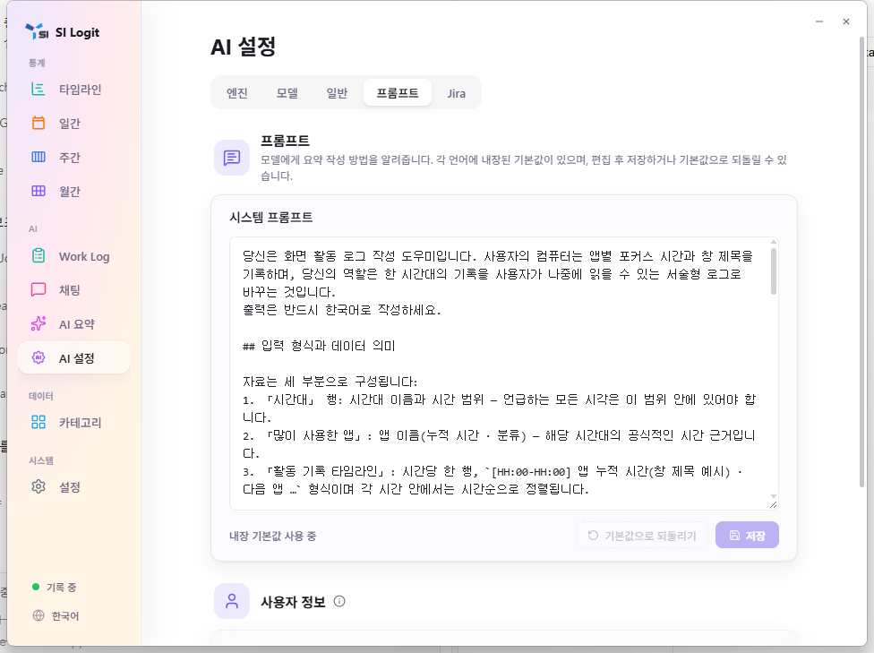

*그림 10. AI 설정 → 프롬프트: 시스템 프롬프트를 검토·편집하고 저장합니다.*

### Jira

- Jira MCP 서버 URL과 PAT를 입력합니다.
- PAT 표시 버튼은 토큰을 화면에 노출할 수 있으므로 주변을 확인한 뒤 사용합니다.
- Work Log 생성 지시문을 필요에 맞게 작성할 수 있습니다.

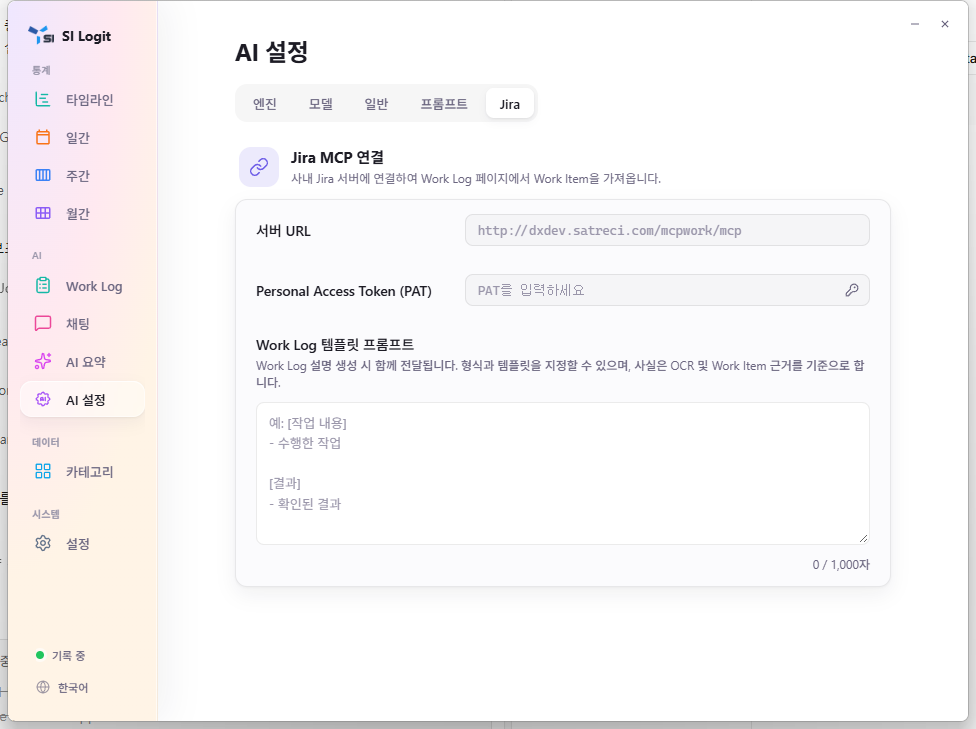

*그림 11. AI 설정 → Jira: MCP 서버 URL, PAT, Work Log 템플릿 프롬프트를 입력합니다.*

> **주의**  URL과 PAT는 Jira 접근 권한을 가질 수 있습니다. 최소 권한 토큰을 사용하고, 토큰이 노출되었다고 판단되면 Jira에서 즉시 폐기·재발급하세요.

## 설정

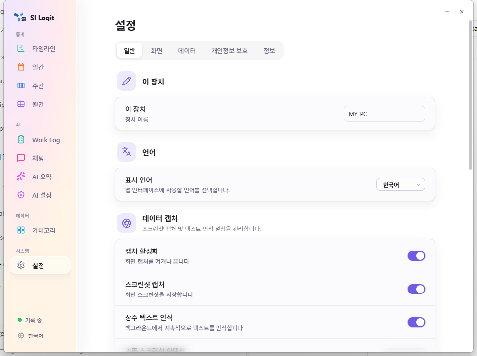

*그림 8. 설정 → 일반: 기기 이름, 언어, 캡처·스크린샷·OCR 옵션을 관리합니다.*

### 일반

- **이 장치 / 언어**: 기기 이름과 앱 표시 언어를 바꿉니다.
- **데이터 캡처**: 기록, 스크린샷, 상주 OCR을 켜거나 끕니다. 캡처 간격과 유휴 판단 시간을 조정하고 스크린샷 저장 위치를 선택합니다.
- **기존 스크린샷 텍스트 인식**: 기존 이미지에 OCR을 실행합니다. 이미지가 많으면 시간이 걸릴 수 있습니다.
- **데이터 위치**: 저장 위치 변경 안내를 읽고 확인합니다. 이동 중에는 앱을 종료하거나 원본을 삭제하지 마세요.
- **업무 시간**: 지정한 시간 밖에는 휴식 상태로 표시됩니다.
- **시작**: 자동 시작, 자동 시작 시 창 표시, 트레이 최소화를 설정합니다.

### 화면

제공되는 테마 카드에서 원하는 화면 테마를 선택합니다. 테마 선택은 이 기기의 표시 환경설정입니다.

### 데이터

- 보존 일수를 설정해 저장 공간을 관리합니다.
- 현재 데이터베이스와 스크린샷 사용량을 확인하고 모델 저장 경로를 지정합니다.
- 사용 기록을 HTML, Markdown, XLSX, JSON 형식으로 내보낼 수 있습니다.
- 스크린샷 폴더와 데이터베이스 위치를 열 수 있으며, 각각을 정리할 수 있습니다.

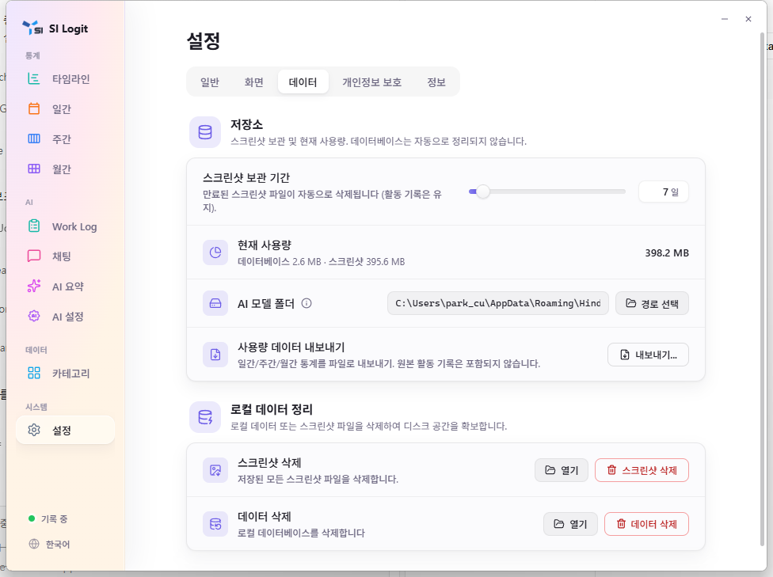

*그림 12. 설정 → 데이터: 스크린샷 보존 기간, 저장 공간, 내보내기와 로컬 데이터 정리를 관리합니다.*

### 개인정보 보호

- URL 키워드를 추가하면 일치하는 브라우저 페이지의 **스크린샷을 저장하지 않습니다**.
- 앱 이름 또는 창 제목 키워드를 추가하면 일치하는 화면의 **스크린샷을 저장하지 않습니다**.
- 브라우저 호스트 기록 여부를 선택합니다.

이 설정은 화면 이미지를 막는 정책입니다. 해당 활동 시간 기록 자체를 지우거나 숨기는 기능은 아닙니다. 비밀·인증·결제 화면처럼 민감한 상황에서는 수집을 멈추는 방법도 함께 사용하세요.

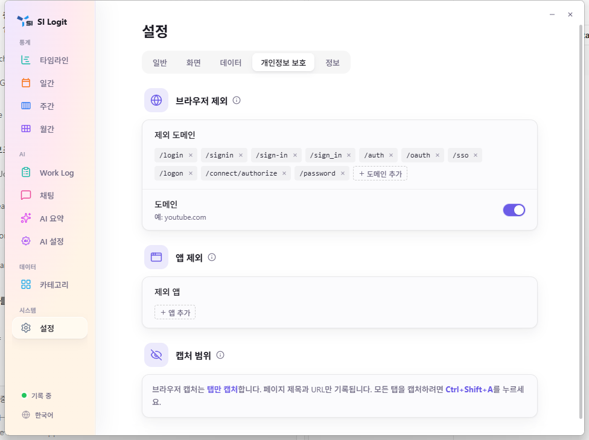

*그림 13. 설정 → 개인정보 보호: 브라우저 URL과 앱 키워드로 스크린샷 제외 대상을 지정합니다.*

### 정보

현재 버전을 확인하고 업데이트를 직접 확인할 수 있습니다. 자동 업데이트를 켠 경우 확인 주기도 선택합니다. 저장소, 피드백, 라이선스 정보를 확인할 수 있습니다.

## 내보내기·보존·삭제

### 내보내기

1. **설정 → 데이터 → 사용 기록 내보내기**를 선택하거나 일간·주간·월간 화면의 내보내기를 사용합니다.
2. 기간과 필요한 범위를 확인합니다.
3. 형식(HTML, Markdown, XLSX, JSON)을 고르고 저장 위치를 선택합니다.
4. 생성한 파일에는 활동 정보가 포함될 수 있으므로 암호화된 저장소 또는 신뢰할 수 있는 공유 경로에만 보관합니다.

### 보존과 삭제 전 확인

- 보존 일수를 줄이면 오래된 데이터와 스크린샷이 정리될 수 있습니다. 필요한 기간은 **먼저 내보내기** 하세요.
- **스크린샷 정리**는 로컬 이미지 파일을 삭제합니다. 이후 OCR 검색 결과에서 이미지 미리보기를 열 수 없을 수 있습니다.
- **활동 데이터 정리**는 로컬 활동 기록을 삭제합니다. 통계, 내보내기, AI 요약에 필요한 원본 기록도 없어질 수 있습니다.
- 삭제 버튼의 확인 창을 읽고, 대상이 스크린샷인지 활동 데이터인지 다시 확인합니다.

> **경고 — 삭제는 되돌릴 수 없습니다.** 삭제 전 내보낸 파일을 열어 내용과 저장 위치를 확인하세요. 앱별 데이터 삭제는 이 기기의 활동·아이콘·실행 경로·관련 OCR 텍스트·해당 스크린샷을 제거할 수 있으며, 이미 만들어진 AI 요약이나 채팅 내용에는 언급이 남을 수 있습니다.

## 개인정보와 클라우드

- SI Logit은 기본적으로 로컬 저장을 지향합니다. 그러나 스크린샷, OCR 텍스트, 채팅 기록은 모두 민감할 수 있습니다.
- 스크린샷을 켜면 화면 전체가 저장될 수 있습니다. 다른 앱이 전면일 때 보인 내용도 이미지에 포함될 수 있습니다.
- OCR을 켜면 스크린샷의 텍스트가 검색 가능한 로컬 데이터가 됩니다.
- 로컬 AI를 사용하면 모델 처리는 기기에서 수행됩니다. 모델과 OCR 구성 요소를 최초로 내려받을 때만 네트워크가 필요할 수 있습니다.
- 클라우드 AI 또는 외부 Jira MCP를 사용하면 입력한 질문·작업 항목·처리에 필요한 기록 일부가 외부 서비스로 전송될 수 있습니다. 서비스의 보안 정책과 조직 규정을 먼저 확인하세요.
- 앱을 숨기거나 무시하는 설정과 데이터 삭제는 서로 다릅니다. 숨김·무시는 표시나 집계에 영향을 줄 수 있지만, 이미 저장된 로컬 데이터나 외부 사본까지 자동으로 제거한다고 가정하면 안 됩니다.

## 문제 해결

### 기록이 보이지 않습니다

1. 왼쪽 아래가 **기록 중**인지 확인합니다.
2. **설정 → 일반 → 데이터 캡처**가 켜져 있는지 확인합니다.
3. 업무 시간을 설정했다면 현재 시간이 범위 안인지 확인합니다.
4. 앱을 다시 시작한 뒤 새 활동이 기록되는지 확인합니다.

### 스크린샷 또는 OCR 검색이 작동하지 않습니다

1. 캡처와 스크린샷이 모두 켜져 있는지 확인합니다.
2. 상주 OCR을 켜고 필요한 구성 요소 다운로드를 완료합니다.
3. 기존 이미지라면 **기존 스크린샷 텍스트 인식**을 실행하고 완료될 때까지 기다립니다.
4. 보존 정책이나 수동 정리로 이미지가 삭제되었는지 확인합니다.

### AI 요약·채팅이 실패합니다

1. **AI 설정 → 엔진**에서 엔진 설치 상태와 연결 테스트를 확인합니다.
2. **AI 설정 → 모델**에서 사용할 모델이 설치·할당되었는지 확인합니다.
3. 로컬 모델은 메모리 상황에 따라 느리거나 실패할 수 있습니다. 엔진 설정을 추천 값으로 되돌리거나 더 가벼운 모델을 사용하세요.
4. 클라우드 모델이라면 네트워크, 제공자 설정, 개인정보 확인 여부를 점검합니다.

### Jira 작업 항목을 가져올 수 없습니다

1. **AI 설정 → Jira**의 서버 URL과 PAT를 다시 확인합니다.
2. 토큰 권한과 만료 여부를 Jira에서 확인합니다.
3. 조직 네트워크 또는 MCP 서버 연결이 가능한지 확인합니다.
4. 테스트 항목이 보이면 실제 Jira 데이터가 아니므로 연결 설정을 수정한 뒤 다시 가져옵니다.

### 삭제 후 데이터를 찾을 수 없습니다

정리·삭제한 로컬 데이터는 복구되지 않습니다. 내보낸 파일이나 별도 백업이 있는지 확인하세요. 앞으로는 보존 기간을 줄이거나 삭제하기 전에 내보내기를 먼저 수행하세요.
